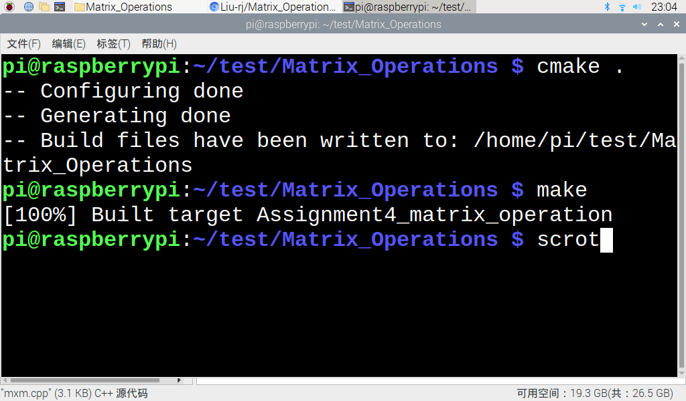
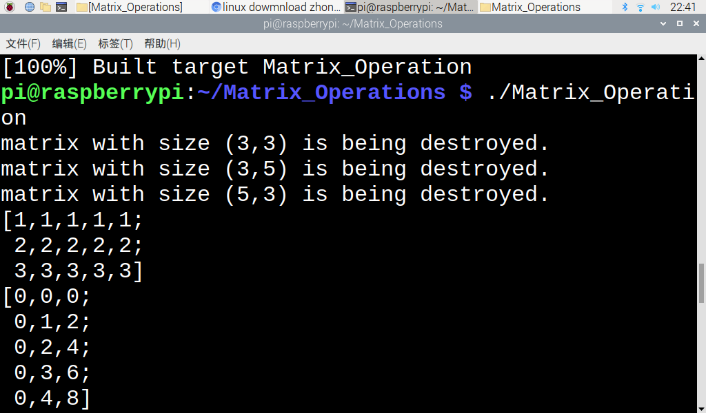
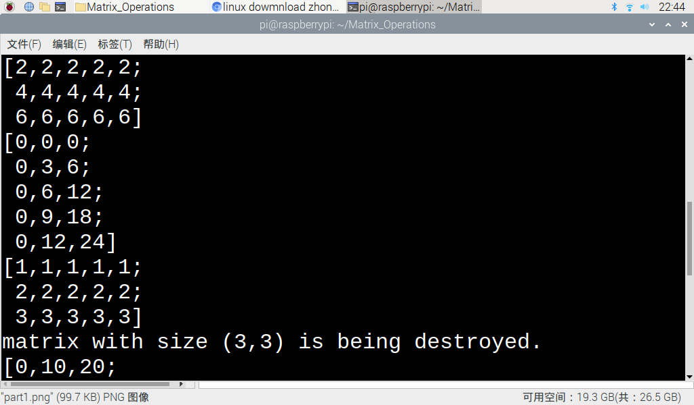
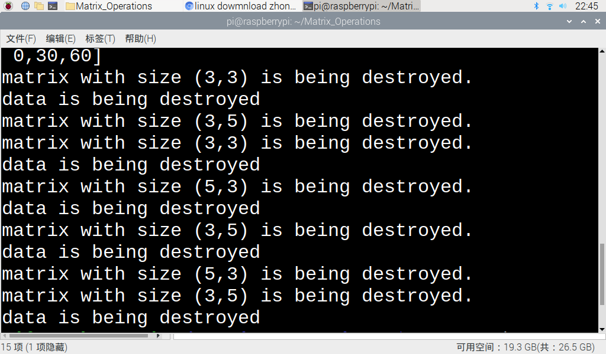

# CS205 C/ C++ Programming - Matrix_Operations

**Name:** 刘仁杰

**SID:** 11911808

## 第0部分

### 本次作业实现功能如下:

* 定义了矩阵类，成员变量包含矩阵的行数，列数，以及矩阵元素。
* 重载定义了+，-，*，=，<<运算符，其中 ” *“定义了三种重载，即A * B, a *B，A * b（小写代表标量）。
* 能够判断运算是否合理，并且能够指出不合理运算的错误所在。
* 向函数传递矩阵类参数依据情况而定, 综合减小内存开销。
* 能够很好的处理指针操作中内存复用和内存泄漏问题。
* 将程序通过arm板成功运行。
* 编写了cmakelist，通过cmake生成makefile，最后通过编译makefile成功运行程序。

## 第一部分 - 思路分析

> assignment4难点主要在于如何进行cpp的内存管理, 从题目中可以知道, matrix类中应该有一个private的指针指向储存矩阵元素的二维矩阵的内存空间, 而我们又知道动态申请的内存空间不是跟静态申请的内存一样压入栈中, **而是存入了堆中**. 这将意味着如果我们不手动释放这片内存空间的话, 他会一直存在于堆内存中, 从而造成**内存泄漏**, 在长时间运行的复杂程序中内存泄露的积攒会导致程序的突然崩溃. 在这一次的作业中我们会看到我们是如何解决这一问题的.

### 1.如何处理内存复用?

在矩阵的运算中, 一个成熟的程序必然要能够处理大尺度的矩阵运算, 在这种情况下, 对于两个矩阵之间的赋值操作我们为了避免内存复用而直接copy矩阵元素值的做法显然是不妥的. 因此我们应该要做一个分类, **即在矩阵大小小于`4*4`的时候我们直接copy矩阵类成员变量的值, 否则对于矩阵类内部的二维指针则采用赋地址的方式进行内存复用**, 同时在析构函数中加上一个判断, 当最终只有一个类使用了一片内存空间的时候才去释放它, 否则让计数器减一. 这样可以保证我们在内存复用的时候不会出现内存泄漏或者重复释放同一片内存空间的情况.

### 2.计数器怎样实现?

那么就又出现了一个问题, 这个计数器该怎样实现呢? 原始的思路是在初始化类开辟空间的时候将二维数组开辟成`(m + 1) * n`大小的, 然后将二维数组第`m + 1`列第一个元素设置成计数器位. 但是这会产生新的一个问题, 用户在输入二维数组指针的时候并不知道matrix类内部的矩阵规格实际上为`(m + 1) * n`, 例如:

```c++
auto **b = new float *[10000];
for (int i = 0; i < 10000; ++i)
{
    b[i] = new float[10000];
    for (int j = 0; j < 5; ++j)
    {
        b[i][j] = i * j;
    }
}

Matrix::Matrix(int row, int column, float **p)
{
    this->row = row;
    this->column = column;
    this->elements = p;
}
```

在上述情形中, 因为矩阵大小过大, 我们直接将指针赋给matrix类的二维数组, 但是, 这将导致原本应该留有的计数位丢失! **所以, 出于对于用户的更高兼容性考虑, 我们将在第二部分给出较好的解决方案.**

### 3.操作符的重载

在重载操作符时, 特别是处理`A = B * C`这类的式子, 其实是由重载的运算符`=`和`*`联合组成的, 那么在这两个函数的对接中又会出现类对象由于超出作用域而被删除的问题和潜在的`+1`风险, 将会在第二部分做着重讨论.

## 第二部分 - 源码分析与展示

### 1.matrix类内嵌套struct初始化

```c++
struct Data
{
    unsigned long count;
    float **elements;
};

class Matrix
{
private:
    int row;
    int column;
    int size{};
    struct Data *data;

public:
    explicit Matrix(int row = 0, int column = 0);

    Matrix(int row, int column, float **p);

    Matrix(int row, int column, const float *p);

    Matrix(Matrix const &matrix);

    int getRow() const;

    void setRow(int i);

    int getColumn() const;

    void setColumn(int i);

    float **getElements() const;

    Matrix &operator=(const Matrix &matrix);

    Matrix operator*(Matrix &matrix);

    Matrix operator*(float t) const;

    friend Matrix operator*(float t, Matrix &matrix);

    friend ostream &operator<<(ostream &os, const Matrix &matrix);

    ~Matrix();

};
```

对于matrix类的编写:
- private: `row`, `column`和`size`记录矩阵的大小信息, 同时, 采用类内嵌套struct指针的方式来存储矩阵元素以及计数器. 我们在`matrix.h`头文件中又定义了一个`struct data`, 专门用来存储计数器和矩阵元素. 这样可以在很好的解决内存管理问题的同时让代码更加简单高效, 同时具有更强的可拓展性. **在这种设计下, 二维数组存储的形式本质上没有改变, 用户可以直接从外部传入二维数组作为矩阵的元素, 同时该二维数组在程序执行周期内没有被类进行任何改变, 保持了数据的原址性.** 同时, 在遇到更加复杂的问题时, **我们可以简单的对struct进行拓展, 即扩展struct内部的变量来应对"多维"的内存管理.**
- public: 三种constructor，destructor，以及各类符号的重载函数接口.

### 2.matrix类的三种constructor

- 初始化m行n列的空矩阵

```c++
Matrix::Matrix(int row, int column)
{
    this->row = row;
    this->column = column;
    size = row * column;
    data = new Data;
    data->elements = new float*[row];
    for (int i = 0; i < row; ++i)
    {
        data->elements[i] = new float[column]{};
    }
    data->count = 1;
}
```

- 带矩阵元素参数传入的初始化

```c++
Matrix::Matrix(int row, int column, float **p)
{
    this->row = row;
    this->column = column;
    this->size = row * column;
    this->data = new Data;
    if (row > 4 && column > 4)
    {
        data->elements = p;
        data->count = 2;
    }
    else
    {
        data->elements = new float*[row];
        for (int i = 0; i < row; ++i)
        {
            data->elements[i] = new float[column];
            for (int j = 0; j < column; ++j)
            {
                data->elements[i][j] = p[i][j];
            }
        }
        data->count = 1;
    }
}
```

可以看到, 我们在初始化时进行了判断,如果传入矩阵大小小于`4*4`, 则copy值, 初始化计数器为1, 否则直接赋地址, 初始计数器为2.

- 传入已有矩阵的初始化

```c++
Matrix::Matrix(Matrix const &matrix)
{
    row = matrix.row;
    column = matrix.column;
    size = row * column;
    data = matrix.data;
    data->count++;
}
```

对于以已有matrix类初始化的类,这里直接采用指针赋值的方式,两个matrix指向同一个矩阵元素内存空间.

- 析构函数

```c++
Matrix::~Matrix()
{
    cout << "matrix with size (" << row << "," << column << ") is being destroyed." << endl;
    if (data->count == 1)
    {
        for (int i = 0; i < row; ++i)
        {
            delete[] data->elements[i];
        }
        delete[] data->elements;
        delete data;
        cout << "data is being destroyed" << endl;
    }
    else
    {
        data->count--;
    }
}
```

在析构函数中, 我们做了一个简单的判断, 如果只有当前调用析构函数的类在使用对应那片内存空间, 即`data->count == 1`, 则在此类调用析构函数时应该释放掉对应矩阵元素和计数器占用的内存空间, 这样就完成了较好的内存管理,避免了内存泄漏.这里为了测试代码正确性, 在每次释放动态申请的内存空间时输出`"data is being destroyed"`来作为提示.

### 3.各类重载函数

- 等号：进行了内存管理操作，判断是否需要释放被赋值的矩阵类的内存

```c++
Matrix &Matrix::operator=(const Matrix &matrix)
{
    if (&matrix == this)
        return *this;

    if (data != nullptr && data->count == 0)
    {
        for (int i = 0; i < row; ++i)
        {
            delete[] data->elements[i];
        }
        delete[] data->elements;
        delete data;
    }
    else
        data->count--;

    row = matrix.row;
    column = matrix.column;
    size = row * column;
    data = matrix.data;
    data->count++;

    return *this;
}
```

可以看到, 如果被赋值的对象原本的数组元素只被它自身占用的话, 则在赋值操作的同时要释放到原本数组元素的内存, 避免内存泄漏.

- "<<": 重载输出运算符

```c++
ostream &operator<<(ostream &os, const Matrix &matrix)
{
    cout << '[';
    for (int i = 0; i < matrix.row; ++i)
    {
        for (int j = 0; j < matrix.column; ++j)
        {
            cout << matrix.data->elements[i][j];
            if (j != matrix.column - 1)
                cout << ',';
        }
        if (i != matrix.row - 1)
        {
            cout << ';' << endl << ' ';
        }
    }
    cout << ']' << endl;
    return os;
}
```

- 乘法：能够判断两个矩阵是否能够相乘，若不能则会提示错误信息

  * A * B 两个矩阵相乘:

    ```c++
    Matrix Matrix::operator*(Matrix &matrix)
    {
        Matrix result;
        if (column != matrix.row)
        {
            cout << "matrix size mismatch!" << endl;
            return result;
        }
        result = Matrix(row, matrix.column);
        mxm(result.data->elements, data->elements, matrix.data->elements, row, column, matrix.row, matrix.column);
        return result;
    }
    ```

  * A * b 矩阵乘以常数:

    ```c++
    Matrix Matrix::operator*(float t) const
    {
        Matrix result(this->row, this->column);
        for (int i = 0; i < row; ++i)
        {
            for (int j = 0; j < column; ++j)
            {
                result.data->elements[i][j] = this->data->elements[i][j] * t;
            }
        }
        return result;
    }
    ```

  * a * B 常数乘以矩阵(利用友元函数实现):

    ```c++
    Matrix operator*(float t, Matrix &matrix)
    {
        Matrix result(matrix.row, matrix.column);
        for (int i = 0; i < matrix.row; ++i)
        {
            for (int j = 0; j < matrix.column; ++j)
            {
                result.data->elements[i][j] = matrix.data->elements[i][j] * t;
            }
        }
        return result;
    }
    ```

这里矩阵乘法沿用了project1的优化算法. 可以满足一般情况下的矩阵乘法运算.

同时要注意的一点是, 与前面的函数不同, 这里的返回值应该是`Matrix`而不是`Matrix &`, 因为在Matrix类的地址时, 超出了函数作用域该matrix则被调用析构函数删除, 此时地址为空不可用, 会报段错误. 而返回`Matrix`不报错是因为编译器将原来临时的matrix调用`copy constructor`copy了一份新的matrix变量存于栈中,等待重载`=`函数的调用.

- 加法: 能够判断两个矩阵是否能够相加，若不能则会提示错误信息

```c++
Matrix Matrix::operator+(Matrix &matrix)
{
    Matrix result;
    if (row != matrix.row || column != matrix.column)
    {
        cout << "matrix size mismatch!" << endl;
        return result;
    }
    result = Matrix(row, column);
    mxa(result.data->elements, data->elements, matrix.data->elements, row, column);
    return result;
}
```

- 减法: 能够判断两个矩阵是否能够相减，若不能则会提示错误信息

```c++
Matrix Matrix::operator-(Matrix &matrix)
{
    Matrix result;
    if (row != matrix.row || column != matrix.column)
    {
        cout << "matrix size mismatch!" << endl;
        return result;
    }
    result = Matrix(row, column);
    mxs(result.data->elements, data->elements, matrix.data->elements, row, column);
    return result;
}
```

## 第三部分 - 结果验证

- 首先简单的测试一下内存管理是否合乎预期

```c++
int main()
{
    Matrix A(1, 1);
    Matrix B = A;
}
```

输出:

```
matrix with size (1,1) is being destroyed.
matrix with size (1,1) is being destroyed.
data is being destroyed
```

可以看到, A和B的内存均被正确释放, 同时A和B复用的动态内存空间也被释放.

- 接下来我们看一个更为复杂的情况

```c++
int main()
{
    Matrix A(1, 1);
    Matrix B = A;
    Matrix C(2, 2);
    B = C;
    A = C;
}
```

输出:

```
data is being destroyed
matrix with size (2,2) is being destroyed.
matrix with size (2,2) is being destroyed.
matrix with size (2,2) is being destroyed.
data is being destroyed
```

可以看到, 三个matrix均被正确释放, 同时两个动态申请的内存空间也被先后释放.

- 综合的复杂矩阵运算测试

```c++
int main()
{
    float a[15] = {1.0f, 1.0f, 1.0f, 1.0f, 1.0f, 2.0f, 2.0f, 2.0f, 2.0f, 2.0f, 3.0f, 3.0f, 3.0f, 3.0f, 3.0f};
    auto **b = new float *[5];
    for (int i = 0; i < 5; ++i)
    {
        b[i] = new float[3];
        for (int j = 0; j < 3; ++j)
        {
            b[i][j] = i * j;
        }
    }
    float c = 2, d = 3;
    Matrix A(3, 5, a);
    Matrix B(5, 3, b);
    Matrix D(A), E(B);
    Matrix C = A * B;
    Matrix F = A + B;
    D = A * c;
    E = d * B;
    cout << A << B << C << D << E << F;
    cout << A * B;

    for (int i = 0; i < 5; ++i)
    {
        delete[] b[i];
    }
    delete[] b;
    return 0;
}
```

输出:

```
data is being destroyed
matrix with size (3,3) is being destroyed.
matrix size mismatch!
matrix with size (3,5) is being destroyed.
matrix with size (5,3) is being destroyed.
[1,1,1,1,1;
 2,2,2,2,2;
 3,3,3,3,3]
[0,0,0;
 0,1,2;
 0,2,4;
 0,3,6;
 0,4,8]
[0,10,20;
 0,20,40;
 0,30,60]
[2,2,2,2,2;
 4,4,4,4,4;
 6,6,6,6,6]
[0,0,0;
 0,3,6;
 0,6,12;
 0,9,18;
 0,12,24]
[]
data is being destroyed
matrix with size (3,3) is being destroyed.
[0,10,20;
 0,20,40;
 0,30,60]
matrix with size (3,3) is being destroyed.
data is being destroyed
matrix with size (0,0) is being destroyed.
data is being destroyed
matrix with size (3,3) is being destroyed.
data is being destroyed
matrix with size (5,3) is being destroyed.
data is being destroyed
matrix with size (3,5) is being destroyed.
data is being destroyed
matrix with size (5,3) is being destroyed.
data is being destroyed
matrix with size (3,5) is being destroyed.
data is being destroyed
```

经过分析, 可以看出静态和动态的内存空间均被正确释放. 注意到, `F = A + B`的操作输出了`matrix size mismatch!`报错提示信息, 且最后输出中F矩阵为`[]`, 符合预期.

## 第四部分 - arm板上测试

> 在这一部分, 我们将在树莓派开发板上用cmake指令运行我们的代码.

- 首先写cmakelist文件后用cmake指令生成makefile运行生成可以执行文件，如图：



- 运行代码查看结果







可以看到, **我们的代码在树莓派开发板上运行正常, 结果均符合预期**.

## 写在最后

> If you are insterested in my work, fork me!

以上是本次报告全部内容, 虽然这只是一次作业, 但后续仍会不断做拓展和优化, 希望能够变成一个逐渐成熟的矩阵运算库.

**感谢观看**